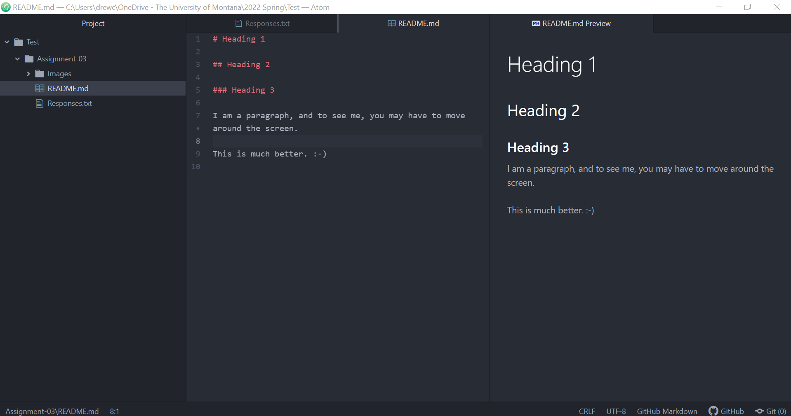

# Heading 1

## Heading 2

### Heading 3

1. The web developer is responsible for making sure that buttons and commands are synced and properly function.

2. Full Stack developers have the knowledge to utilize both front-end and back-end development.

3. "UX Design" represents "User Experience Design".

[Oragami Ink Website](https://www.origamiink.com/)

[My Responses](./responses.txt)

