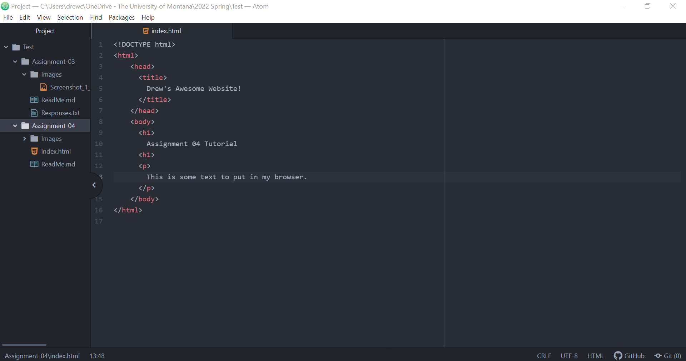

1. A web browser, or internet browser, is a software program tool that people can utilize to access the internet from a device. Browsers translate web designers' web languages (examples include HTML, CSS, and JavaScript) and render them into the intended layouts of graphics, texts, and other website content. My primary browser on my laptop is Microsoft Edge, and I will sometimes use Chrome for instances in which that browser is more appropriate and supports a website's functions more completely. On my phone, the browser I most often use is Safari.
2. Image Through Relative URL Link:

