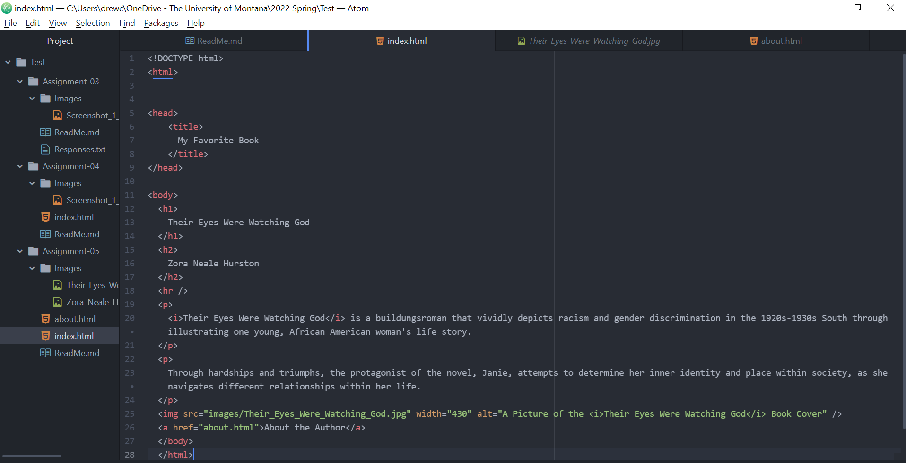

One website I visited using The Wayback Machine was https://www.webkinz.com/. I compared the webpage of February 16, 2022 with a webpage from December 17, 2008. The older version different from the newer version in several ways with the primary alteration being the style of graphics used. The most recent home webpage has vibrant colors, lots of complex Webkinz "pet" character computer graphics, and the use of stylized typography. Also, the subsections with links to other portions of the website are sleek in appearance. This visual image is contrasted with the past webpage which is more compartmentalized. Instead of integrating subsections into the overall image of Webkinz pets, which more two dimensional and not as clear or distinct as the modern webpage pets image, there are individual selection buttons which appear clunky.

