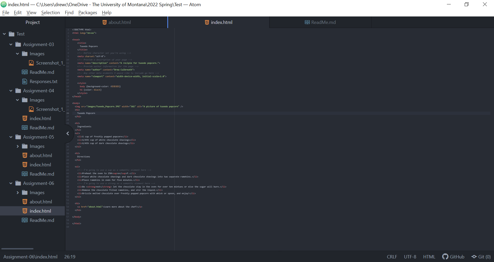

1.Structural markup embeds information about the structure of a document, including headings, paragraphs, breaks, and lists. These elements will help visually guide a user and provide information about the type of content within a document. A browser utilizes structural markup to assist screen readers and other accessibility based software. In contrast, semantic markup is utilized to reinforce the semantic, or meaning, of the information in a document. Examples of semantic markup include placing emphasis on a word or identifying the word as strong. Additionally, citations, quotations, links to definitions, or distinguished editorial changes can be created through the use of semantic markup.

