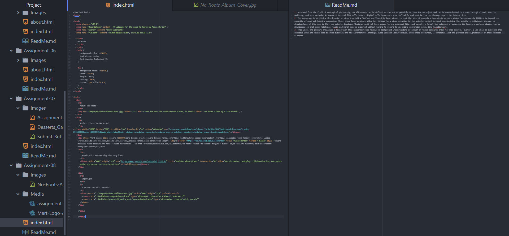

1. Borrowed from the field of ecological philosophy, an affordance can be defined as the set of possible actions for an object and can be communicated to a user through visual, tactile, auditory, and more methods. As compared to real life affordances, digital affordances are more inflexible and must be learned through repetitive interactions.
2. The advantage to utilizing third-party services (including YouTube and Vimeo) to host videos is that the size of roughly a ten minute or more video (approximately 100MB+) is beyond the capacity of most web hosting companies. Thus, these host services allow for linkage to a video relative to the website content without overwhelming the website's individual storage. A disadvantage of this use is that the website developer/designer will not have access to the original file, and cannot re-format the material or compress it. However, certain plugins can be downloaded so that some filetypes (.webm and more) can be exported without having to resort to an online conversion site, like CloudConvert.
3. This week, the primary challenge I faced with this assignment was having no background understanding or notion of these concepts prior to this course. However, I was able to overcome this obstacle with the video step by step tutorial and the informative, thorough class website weekly module. With these resources, I conceptualized the purpose and significance of these website elements.

