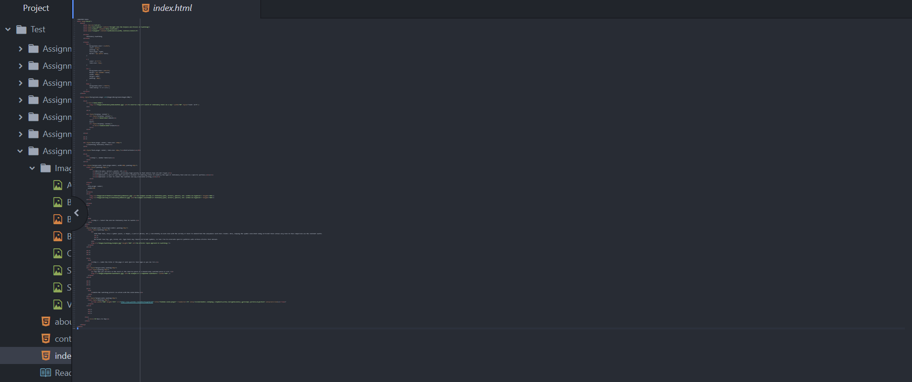

Learning HTML was an interesting process. Having no background knowledge of website development and design whatsoever, every piece of knowledge gained was exciting! Conceptualizing the idea and history of the internet and how our webpages and commands fit into the global internet system was amazing. Before this course, I knew that these webpage components existed because I interact with them on a daily basis, but comprehending the innerworkings of how digital mechanisms create vibrancy on webpages was truly stunning. The most difficult concept to grasp was the "div" tool, but after thoroughly reading and watching videos about the topic, I now feel that I understand this component of HTML.

I am thrilled to start learning CSS! Now that I have the HTML background, I feel that I can better create a functional, interactive website interface. The thing I am most excited about is to explore typographic, color, and general aesthetic elements that can significantly improve the user perception and experience of exploring a website.

