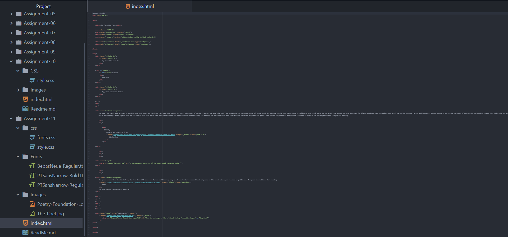

1. Typography is the art, engineering, and technique of arranging type to make written language appealing and legible when displayed.

2. The importance of having fallback fonts in a font stack is that, if the browser is unable to properly display the primary font choice, then the next available fall back font will be presented instead. Selecting an appropriate fall back font is key, because if contrasting fonts quickly flash between each other, this could be confusing and jarring for the user.

3. System fonts are already installed on a local device and system, and while they are available to the user in specific computer programs, they are not always applicable to webpage usage on the internet. The reason some of these fonts are not appropriate for websites is that they are exported as images, which can unnecessarily complicate the assistive technologies and search engine indexing. Web fonts are custom fonts that are hosted on a server, meaning that they do not have to be available on the user's device to appear. The majority of websites use this font system because they are optimized for website performance. And, if need be, fallback fonts can also be applied. The security of web-safe fonts is that they can consistently be counted on as being available by the system, so that the client computer will already have this font, which reduces load times and has the potential to increase performance.

