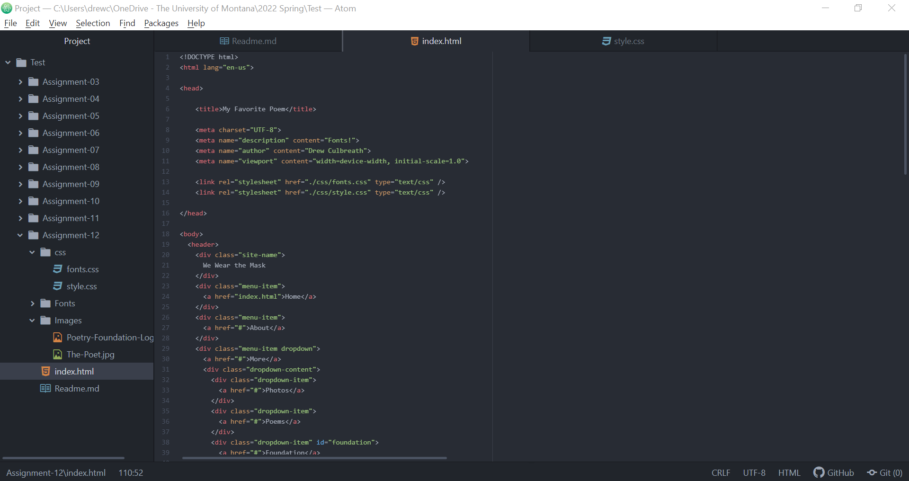

1. Borders help to define the amount of space a box or elements take up, as well as its relationship to other boxes, and is more of a visual styling tool than a space management device. Unlike the margin and padding concepts, the border portion of the box can be separately colored and have multiple style options. Padding can be defined as the amount of space between the inner content of the element and the element itself. Through this technique, a website designer can change the size of individual boxes and control the relationships of elements to each other. The margin is the space between the box element and other elements, or the edge of the parent element.

2. This week's assignment was different from past weeks due to the fact that the best way to complete this assignment was to alter a pre-existing work, as opposed to creating a new website from scratch. In this way, it was refreshing to build upon something I had already created and give this work more depth and polished touches. At the same time, this assignment felt more intensive as it required lots of specific CSS instruction in order to best fit the website to my preferences as the designer.

