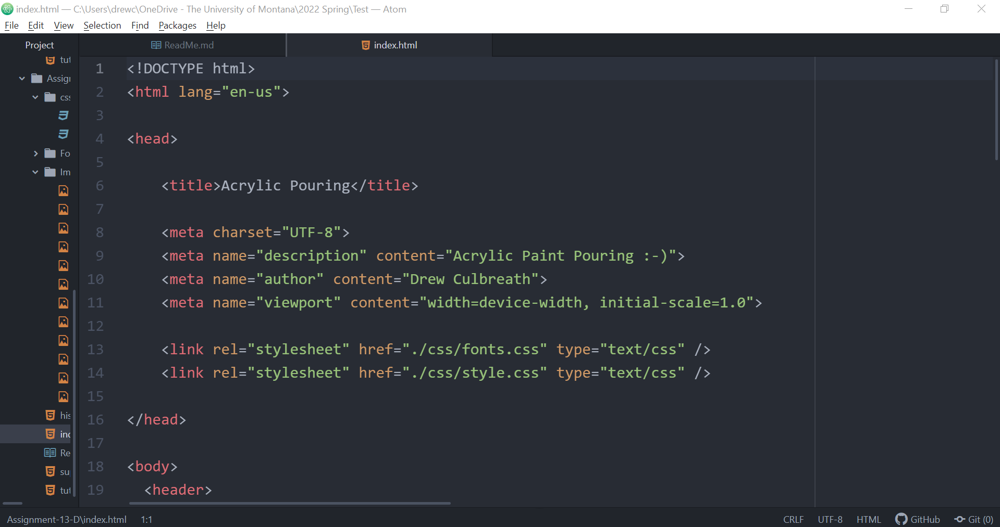

1. The goal of my website is to expose, inform, and educate the user about the artform of pour painting. My website is intended to serve as an introduction to the concept, history, supplies, and tutorials related to pour painting. My hope is that a person, with no background knowledge or exposure to pour painting, could easily navigate my website and gain a general understanding of the artform. Additionally, I would be thrilled if the website could inspire people to further explore pour painting as a hobby, relaxation outlet, or professional endeavor.

2. Responsive web design is important because by utilizing this method of website coding, a user can access the website content, as intended by the website designer and developer, on any digital device (particularly relating to laptop and mobile device compatibility). The practical application of this technology centers around ensuring that the HTML and CSS automatically resize to appropriately fit the user's device in an aesthetically pleasing and easily navigable and understandable format.

