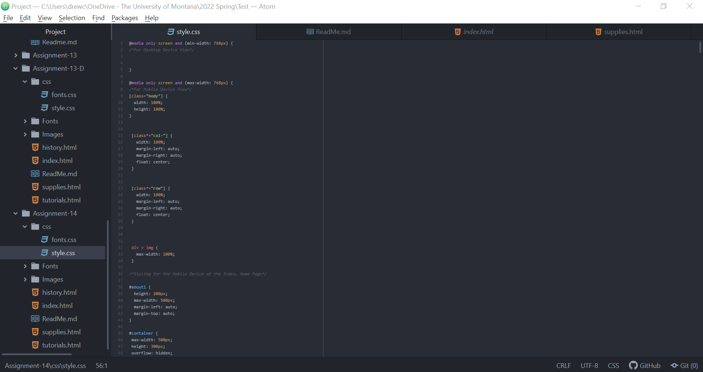

1. My user testing sessions went well. It was exciting and somewhat nerve wracking to share an artwork of my own creation with others in order to hear their honest feedback. However, my anticipation subsided when my testing participants eagerly navigated the webpage and hovered over all elements to see what interactive features were available. I did not guide them or tell them anything about the website prior to these testing sessions, so their opinions on navigability, design, and information comprehension was entirely of their own perceptions. After the testing sessions, I realized just how crucial it is to have people, especially of different demographics, interact with and examine a website for the sole purposes of improvements and further development.

2. I made two changes to my website this week based on my user feedback, one from each testing participant. The first change was that, "Participant D" noticed that, if this website is intended for novice paint pourers or people who have no background on the subject, it would be helpful to link the minimum required supplies. I completely agreed and rewrote my HTML where the text with the six image bubbles on the supplies webpage, when hovered, linked to each bubble's purchasable individual supply on a separate website. Adding this element most definitely ensured that the user had the most accurate, relevant information and products as readily available as possible. The other adjustment I made, as highlighted by "Participant A", related to the importance of responsive web design. For last week's assignment of creating an initial draft of the website, I decided to add my responsive web design elements into the draft this week. The significance of this component was made clear when Participant A actively tested sizing the website up and down, and the website components did not conform to her desired window size specifications.

3. This week, I was thrilled when I applied my previously learned knowledge about how to link a separate website on my own website through clicking on the text on a personally created webpage. I used this principle to create links for my bubble pictures and descriptions of necessary paint pouring supplies on the supplies webpage to connect them with other website pages related to the purchase of each individual supply item. The biggest challenge I faced this week was the integration of responsive web design coding. I attempted to apply what Professor Rezvani demonstrated in her tutorial video, but some of my website elements do not seem to respond to the code commands or are overridden by some aspect of the code I overlooked. Some of the elements will shrink, but I cannot get them to align in the center of the webpages, and the six supply bubbles will not change to a vertical layout. As a result, I will contact Professor Rezvani to gain her insight and help into the matter.

